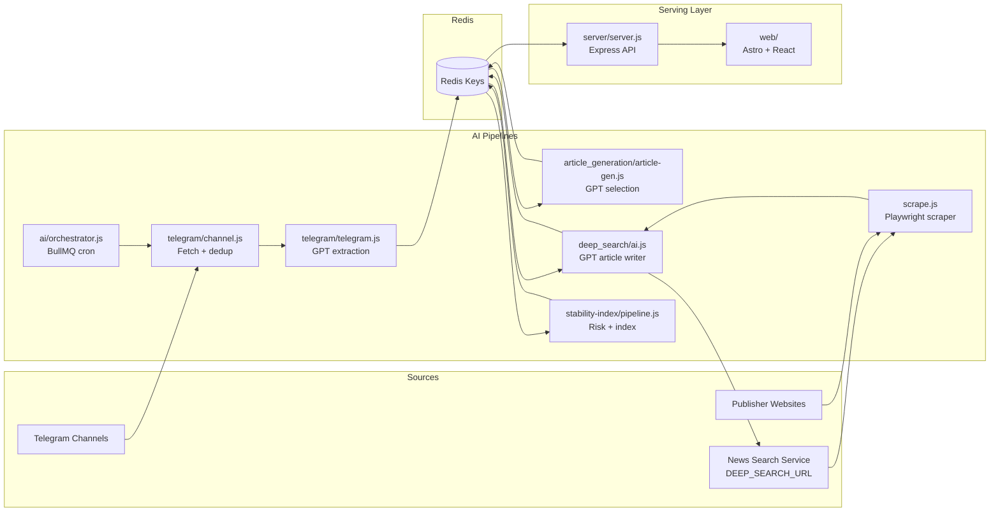

# World Intelligence

A multi-stage intelligence pipeline that ingests Telegram OSINT + web search context, generates curated news outputs with AI, computes regional stability signals, and serves everything to a dashboard UI.

## What This Project Does

- Collects latest messages from configured Telegram channels.
- Deduplicates + summarizes those messages into structured news snippets.
- Selects marquee headlines and article candidates.
- Runs deep web research for selected stories, scrapes sources, and writes concise articles.
- Computes `India` and `World` stability summaries from regional news collections.
- Exposes data via an Express API consumed by an Astro + React dashboard.

## System Architecture



## Data Sources (And Where They Enter)

```mermaid
flowchart TD
  A[Telegram channels\nTG_CHANNEL_LINKS or defaults] --> B[syncTelegramChannels]
  B --> C[telegram:dedup:latest20]
  B --> D[telegram:new:latest20]
  D --> E[TelegramSummary with GPT]
  C --> E
  E --> F[Telegram-Info / Telegram-Desc]

  G[newsCollection + newsCollection:India/World\nupstream producer required] --> H[Article selection + Stability scoring]

  I[DEEP_SEARCH_URL API\nquery -> URL list] --> J[WebSearchTool]
  J --> K[Playwright scrape(urls)]
  K --> L[savedArticles + source URLs + ogImage]
```

Notes:
- Default Telegram channels in code: `WNGNEW`, `GoreUnit99`, `elitepredatorss`, `OsintTv`, `OSINTdefender`.
- `newsCollection` and `newsCollection:{region}` are consumed here but not produced in this repo.

## Redis Data Contract

```mermaid
flowchart LR
  subgraph Producers
    P1[Telegram SaveTool]
    P2[Article selection tools]
    P3[Deep search SaveArticle]
    P4[Stability pipeline]
  end

  subgraph Keys
    K1[Telegram-Info]
    K2[Telegram-Desc]
    K3[newsMarquee]
    K4[selectedArticles]
    K5[Coordinates]
    K6[savedArticles]
    K7[stability_summary:India]
    K8[stability_summary:World]
    K9[stability_score:India/World]
  end

  subgraph API
    A1[/v1/telegram]
    A2[/v1/marquee]
    A3[/v1/coordinates]
    A4[/v1/breaking-news]
    A5[/v1/stability/:region]
  end

  P1 --> K1 --> A1
  P1 --> K2
  P2 --> K3 --> A2
  P2 --> K4
  P2 --> K5 --> A3
  P3 --> K6 --> A4
  P4 --> K7 --> A5
  P4 --> K8 --> A5
  P4 --> K9
```

## Repository Layout

```text
.
├── ai/
│   ├── orchestrator.js
│   ├── telegram/
│   ├── article_generation/
│   ├── deep_search/
│   ├── stability-index/
│   └── x_search/
├── server/
│   └── server.js
└── web/
    └── src/
```

## API Endpoints

- `GET /v1/marquee` -> headline array from `newsMarquee`
- `GET /v1/coordinates` -> map payload from `Coordinates`
- `GET /v1/telegram` -> minimized Telegram cards (`title`, `desc`)
- `GET /v1/breaking-news` -> deep-search article objects from `savedArticles`
- `GET /v1/stability/:region` -> regional stability summary (`India`, `World`)

## Required Environment Variables

Core:
- `REDIS_URL` (default: `redis://127.0.0.1:6379`)

Telegram ingest:
- `TG_API_ID`
- `TG_API_HASH`
- `TG_SESSION_STRING`
- `TG_CHANNEL_LINKS` (optional, comma-separated)

AI providers:
- `OPENAI_API_KEY` (telegram/article/deep-search/stability pipelines)
- `OPENROUTER_API_KEY` (only for `ai/x_search/x.js`)

Deep search:
- `DEEP_SEARCH_URL` (default: `http://192.168.0.99:8000/v1/news`)

Optional runtime tuning:
- `TG_QUEUE_NAME`
- `SAVED_ARTICLES_KEY`
- `SCRAPE_CONCURRENCY`
- `MIN_CONTENT_LENGTH`

## Local Runbook

Install dependencies:

```bash
cd ai && npm install
cd ../server && npm install
cd ../web && npm install
```

Run the API server:

```bash
cd server
node server.js
```

Run Telegram pipeline once:

```bash
cd ai
node telegram/pipeline.js
```

Run Telegram scheduler (BullMQ cron):

```bash
cd ai
node orchestrator.js
```

Generate headline + article candidates from `newsCollection`:

```bash
cd ai
node article_generation/pipeline.js
```

Write deep-search articles for `selectedArticles`:

```bash
cd ai
node deep_search/pipeline.js
```

Compute stability summaries:

```bash
cd ai
node stability-index/pipeline.js
```

Run web dashboard:

```bash
cd web
npm run dev
```

## Typical Processing Order

1. Populate `newsCollection` and `newsCollection:India/World` (upstream feed).
2. Run `ai/article_generation/pipeline.js` to create `newsMarquee`, `selectedArticles`, and `Coordinates`.
3. Run `ai/deep_search/pipeline.js` to create `savedArticles`.
4. Run `ai/stability-index/pipeline.js` to refresh regional stability summaries.
5. Run `ai/orchestrator.js` (or `ai/telegram/pipeline.js`) for Telegram OSINT updates.
6. Serve via `server/server.js` and render via `web`.
