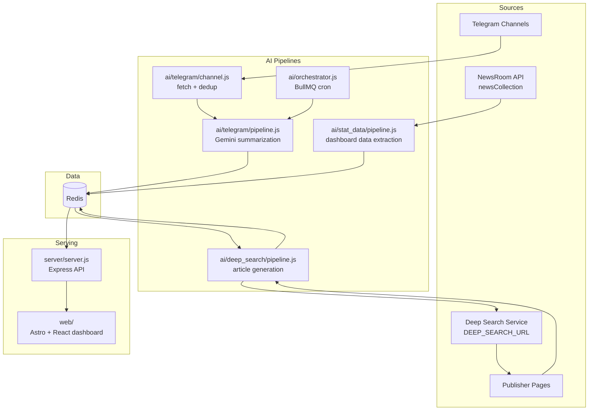
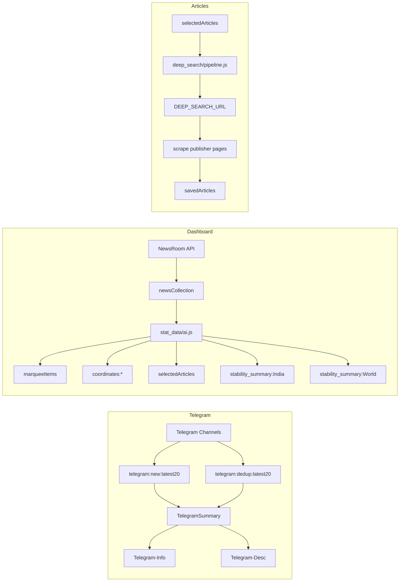
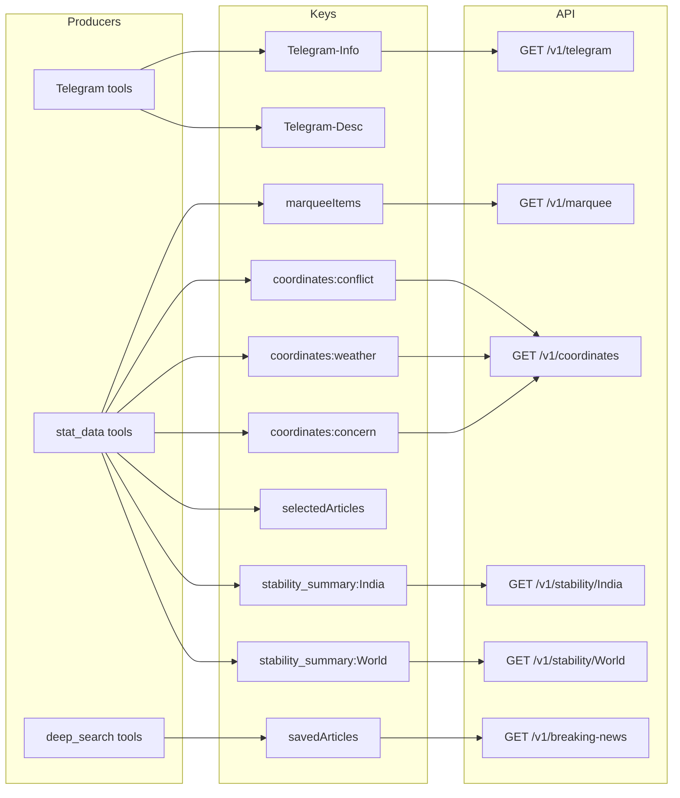

# World Intelligence

World Intelligence is a Redis-backed intelligence dashboard made of three parts:

- `ai/` collects and transforms intel data with Gemini-powered pipelines
- `server/` exposes the stored data through a small Express API
- `web/` renders the dashboard with Astro, React, Tailwind, and Leaflet

The current product surface is an `INTEL` dashboard with:

- scrolling marquee headlines
- geospatial event markers
- India and World stability panels
- AI-written breaking-news cards
- Telegram OSINT summaries

## Current Architecture

```text
Telegram channels ----> ai/telegram/* ---------------------> Redis
newsCollection -------> ai/stat_data/* --------------------> Redis
selectedArticles -----> ai/deep_search/* + external search -> Redis
Redis ----------------> server/server.js ------------------> HTTP API
HTTP API -------------> web/src/pages/index.astro ---------> Dashboard UI
```



## Data Flows



## What Lives Where

```text
.
├── ai/
│   ├── orchestrator.js
│   ├── telegram/
│   ├── stat_data/
│   ├── stability-index/
│   ├── deep_search/
│   ├── article_generation/
│   └── x_search/
├── server/
│   └── server.js
└── web/
    └── src/
```

## Runtime Responsibilities

### `ai/`

This folder contains the data-generation side of the system.

- `ai/telegram/channel.js`
  Fetches the latest Telegram messages from configured channels, deduplicates them, and stores both full recent history and newly seen items in Redis.
- `ai/telegram/pipeline.js`
  Runs the Telegram sync, builds a plain-text digest from the latest messages, and sends that digest to Gemini for structured news extraction.
- `ai/telegram/tools.js`
  Saves Telegram summaries into `Telegram-Info` and `Telegram-Desc`.
- `ai/orchestrator.js`
  Schedules the Telegram pipeline with BullMQ on a cron in `Asia/Kolkata`.
- `ai/stat_data/pipeline.js`
  Reads `newsCollection` from Redis and sends it to Gemini for dashboard data generation.
- `ai/stat_data/ai.js`
  Produces marquee items, coordinate markers, article candidates, and stability assessments.
- `ai/deep_search/pipeline.js`
  Reads `selectedArticles`, performs web search and scraping, and saves finished article cards.
- `ai/stability-index/compute_layer.js`
  Converts structured risk/stabilizer assessments into a numeric stability score.

### `server/`

`server/server.js` connects to Redis and serves the data the dashboard needs.

Important detail:
- the server loads environment variables from `ai/.env`
- default API port is `8006`

### `web/`

The dashboard lives in `web/` and is rendered by Astro with React islands.

Main UI sections:

- `NewsMarquee`
- `IndiaMap`
- `StabilityPanels`
- `BreakingNewsFeed`
- `TelegramOsint`

The page fetches data from `PUBLIC_API_BASE_URL`, falling back to `http://192.168.0.99:8006`.

## Redis Data Contract

The current code reads and writes these keys:

### Produced by Telegram pipeline

- `telegram:dedup:latest20`
  Latest deduplicated Telegram messages by channel.
- `telegram:new:latest20`
  Newly seen Telegram messages by channel.
- `Telegram-Info`
  Array of structured Telegram summary cards.
- `Telegram-Desc`
  Description-only subset of the Telegram summaries.

### Produced by `ai/stat_data`

- `marqueeItems`
  List of short marquee headlines.
- `coordinates:conflict`
  Redis list of JSON arrays shaped like `[lat, lng, desc]`.
- `coordinates:weather`
  Same format for weather/climate events.
- `coordinates:concern`
  Same format for concern/risk markers.
- `selectedArticles`
  JSON array of article candidates for deep-search expansion.
- `stability_assessment:World`
- `stability_assessment:India`
- `stability_summary:World`
- `stability_summary:India`
- `stability_score:World`
- `stability_score:India`

### Consumed from upstream

- [](https://github.com/aneeshpatne/news_room.git)

- `newsCollection`
  This repo reads this key, and it is populated by the NewsRoom API:
  https://github.com/aneeshpatne/news_room.git

### Produced by deep search

- `savedArticles`
  Redis list of article objects with article body, source URLs, and optional OG image.



## API

The Express server currently exposes:

- `GET /v1/marquee`
- `GET /v1/coordinates`
- `GET /v1/telegram`
- `GET /v1/breaking-news`
- `GET /v1/stability/:region`

Expected regions for the stability route are currently `India` and `World`.

## Environment Variables

Most runtime configuration is expected in `ai/.env`.

### Core

- `REDIS_URL`
- `PORT` for the API server, optional
- `PUBLIC_API_BASE_URL` for the web app, optional

### Gemini / AI

- `GEMINI_API_KEY`

### Telegram

- `TG_API_ID`
- `TG_API_HASH`
- `TG_SESSION_STRING`
- `TG_CHANNEL_LINKS` optional comma-separated override
- `TG_QUEUE_NAME` optional BullMQ queue name
- `TG_REDIS_KEY` optional override, default `telegram:dedup:latest20`
- `TG_REDIS_NEW_KEY` optional override, default `telegram:new:latest20`
- `TG_SUPPRESS_TIMEOUT_LOGS` optional

Default Telegram channels in code:

- `WNGNEW`
- `GoreUnit99`
- `elitepredatorss`
- `OsintTv`
- `OSINTdefender`

### Deep Search

- `DEEP_SEARCH_URL`
- `SAVED_ARTICLES_KEY` optional override for `savedArticles`

## Install

Install dependencies per package:

```bash
cd ai
npm install
```

```bash
cd server
npm install
```

```bash
cd web
npm install
```

## Run Locally

### 1. Start Redis

Use your local Redis instance or set `REDIS_URL` to a reachable server.

### 2. Start the API

```bash
cd server
node server.js
```

### 3. Start the dashboard

```bash
cd web
npm run dev
```

### 4. Run data pipelines as needed

Telegram pipeline once:

```bash
cd ai
node telegram/pipeline.js
```

Telegram scheduler:

```bash
cd ai
node orchestrator.js
```

Dashboard data generation from `newsCollection`:

```bash
cd ai
node stat_data/pipeline.js
```

Deep-search article generation from `selectedArticles`:

```bash
cd ai
node deep_search/pipeline.js
```

## Typical Data Flow

### Telegram path

1. `ai/telegram/channel.js` fetches Telegram messages.
2. Redis stores deduplicated and newly seen messages.
3. `ai/telegram/pipeline.js` summarizes them with Gemini.
4. The server exposes the summaries through `/v1/telegram`.
5. The dashboard renders them in the Telegram OSINT panel.

### Dashboard data path

1. Some upstream process writes `newsCollection`.
2. `ai/stat_data/pipeline.js` reads that digest.
3. Gemini generates:
   - marquee items
   - map coordinates
   - article candidates
   - India stability summary
   - World stability summary
4. The server exposes those keys through the API.
5. The dashboard renders the marquee, map, and stability panels.

### Article path

1. `selectedArticles` is written by `ai/stat_data`.
2. `ai/deep_search/pipeline.js` reads each candidate.
3. The deep-search pipeline calls an external search service, scrapes resulting pages, and writes article cards into `savedArticles`.
4. The server exposes them through `/v1/breaking-news`.
5. The dashboard renders them in Breaking News.
