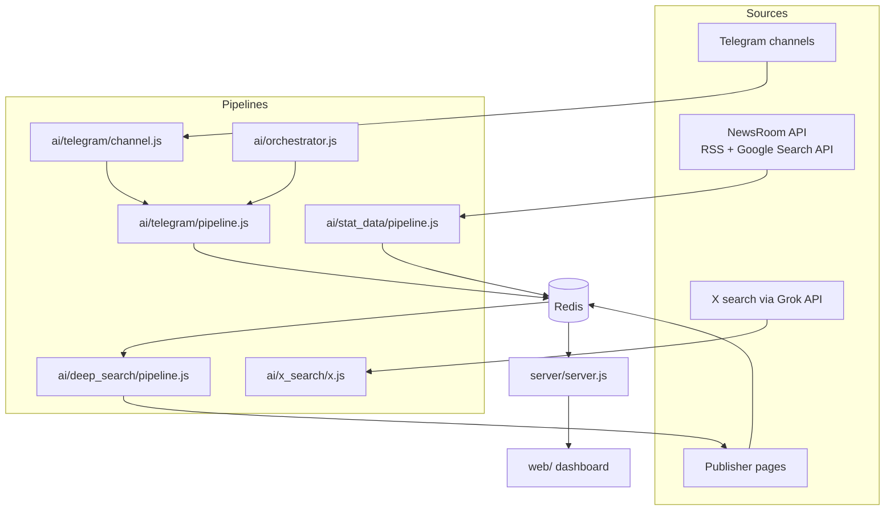

# World Intelligence

`World Intelligence` is an AI-assisted intel dashboard that turns noisy open-source inputs into a fast, visual operating picture.

It pulls from multiple upstream feeds, writes structured outputs into Redis, serves them through a small Express API, and renders the result as an Astro dashboard with maps, stability panels, breaking-news cards, and Telegram OSINT summaries.

## What It Does

- Ingests upstream news and channel data
- Extracts marquee headlines, map markers, and stability assessments
- Selects high-priority stories for deeper article generation
- Stores everything in Redis as the shared runtime state
- Exposes the data through a simple API
- Renders the final intel UI in the browser

## Source Stack

The system is built around a mix of upstream feeds and search-backed enrichment:

- Telegram channels for OSINT-style channel monitoring
- X (formerly Twitter) as a source via X search through the Grok API in [`ai/x_search/x.js`](/home/aneesh/code/world-intelligence/ai/x_search/x.js)
- RSS news feeds from the NewsRoom API pipeline
- Google Search API results from the NewsRoom API pipeline
- Publisher page scraping during deep-search article generation

The repo currently consumes `newsCollection` from the separate NewsRoom pipeline, which is where the RSS and Google Search API aggregation comes from.

- NewsRoom repo: `https://github.com/aneeshpatne/news_room.git`

## Repo Layout

```text
.
├── ai/        AI and ingestion pipelines
├── server/    Express API over Redis data
└── web/       Astro dashboard frontend
```

## Architecture



## Runtime Flow

### 1. Telegram pipeline

- [`ai/telegram/channel.js`](/home/aneesh/code/world-intelligence/ai/telegram/channel.js) fetches and deduplicates recent Telegram messages
- [`ai/telegram/pipeline.js`](/home/aneesh/code/world-intelligence/ai/telegram/pipeline.js) summarizes them
- Results land in Redis keys such as `telegram:dedup:latest20`, `telegram:new:latest20`, and `Telegram-Info`

### 2. Dashboard data pipeline

- [`ai/stat_data/pipeline.js`](/home/aneesh/code/world-intelligence/ai/stat_data/pipeline.js) reads `newsCollection`
- [`ai/stat_data/ai.js`](/home/aneesh/code/world-intelligence/ai/stat_data/ai.js) extracts:
  - marquee headlines
  - coordinate markers
  - India stability summary
  - World stability summary
  - selected article candidates

### 3. Article generation pipeline

- [`ai/deep_search/pipeline.js`](/home/aneesh/code/world-intelligence/ai/deep_search/pipeline.js) reads `selectedArticles`
- [`ai/deep_search/tools.js`](/home/aneesh/code/world-intelligence/ai/deep_search/tools.js) calls the configured search service via `DEEP_SEARCH_URL`
- Matching publisher pages are scraped and saved as `savedArticles`

### 4. API + frontend

- [`server/server.js`](/home/aneesh/code/world-intelligence/server/server.js) reads Redis and exposes JSON endpoints
- [`web/src/pages/index.astro`](/home/aneesh/code/world-intelligence/web/src/pages/index.astro) fetches those endpoints and renders the dashboard

## Product Surface

The current UI includes:

- scrolling marquee headlines
- geospatial event markers
- India and World stability panels
- AI-generated breaking-news article cards
- Telegram OSINT summaries

## API

Current server endpoints:

- `GET /v1/marquee`
- `GET /v1/coordinates`
- `GET /v1/telegram`
- `GET /v1/breaking-news`
- `GET /v1/stability/:region`

Supported stability regions in the current UI are `India` and `World`.

## Redis Keys

Primary keys used by this repo:

- `newsCollection` from the upstream NewsRoom pipeline
- `marqueeItems`
- `coordinates:conflict`
- `coordinates:weather`
- `coordinates:concern`
- `selectedArticles`
- `selectedArticles:list`
- `savedArticles`
- `Telegram-Info`
- `Telegram-Desc`
- `telegram:dedup:latest20`
- `telegram:new:latest20`
- `stability_summary:India`
- `stability_summary:World`
- `stability_assessment:India`
- `stability_assessment:World`
- `stability_score:India`
- `stability_score:World`

## Environment

Most runtime configuration is loaded from `ai/.env`.

### Core

- `REDIS_URL`
- `PORT`
- `PUBLIC_API_BASE_URL`

### AI

- `GEMINI_API_KEY`
- `OPENROUTER_API_KEY`

### Telegram

- `TG_API_ID`
- `TG_API_HASH`
- `TG_SESSION_STRING`
- `TG_CHANNEL_LINKS`
- `TG_QUEUE_NAME`
- `TG_REDIS_KEY`
- `TG_REDIS_NEW_KEY`
- `TG_SUPPRESS_TIMEOUT_LOGS`

Default Telegram channels live in [`ai/telegram/default-channels.js`](/home/aneesh/code/world-intelligence/ai/telegram/default-channels.js).

### Deep search

- `DEEP_SEARCH_URL`
- `SAVED_ARTICLES_KEY`

## Local Setup

Install dependencies in each package:

```bash
cd ai && npm install
cd server && npm install
cd web && npm install
```

Start Redis first, or point `REDIS_URL` at a reachable instance.

Run the API:

```bash
cd server
node server.js
```

Run the dashboard:

```bash
cd web
npm run dev
```

Run pipelines as needed:

```bash
cd ai
node telegram/pipeline.js
node orchestrator.js
node stat_data/pipeline.js
node deep_search/pipeline.js
node x_search/x.js
```

## Notes

- The frontend defaults `PUBLIC_API_BASE_URL` to `http://192.168.0.99:8006` when unset in [`web/src/pages/index.astro`](/home/aneesh/code/world-intelligence/web/src/pages/index.astro#L8)
- The API server loads environment variables from `ai/.env` in [`server/server.js`](/home/aneesh/code/world-intelligence/server/server.js#L7)
- There is no top-level package manager entrypoint right now; `ai/`, `server/`, and `web/` are run separately
