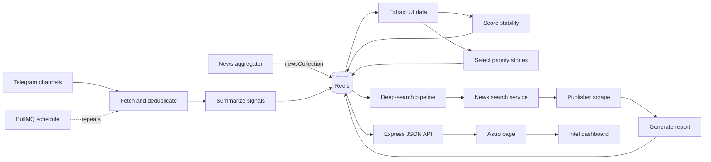
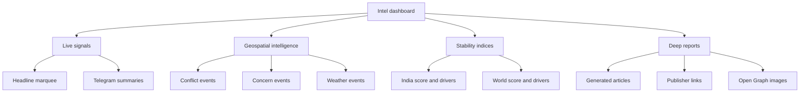
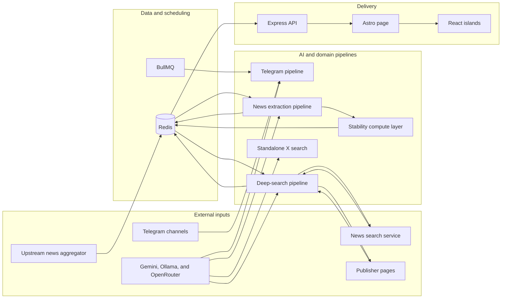

<div align="center">


  <h1>Intel</h1>

<strong>Turn fragmented open-source reporting into one focused operating picture.</strong>

  <p>Intel transforms aggregated news and Telegram channel activity into mapped events, regional stability assessments, concise signals, and source-backed reports.</p>

  <p>
    <a href="https://developer.mozilla.org/en-US/docs/Web/JavaScript"></a>
    <a href="https://astro.build/"></a>
    <a href="https://expressjs.com/"></a>
    <a href="https://nodejs.org/"></a>
    <a href="LICENSE"></a>
  </p>
</div>

---

## Overview

Intel accepts a news digest already stored in Redis by an upstream aggregator and recent messages collected from configured Telegram channels. Its pipelines deduplicate and summarize the material, extract display headlines and geospatial events, calculate India and World stability views, and expand selected topics into reports. The result is a compact dashboard for scanning what happened, where it happened, and which developments deserve closer attention.

The interface is an Astro page composed from React islands, styled with Tailwind CSS and a dark, glass-panel visual system. Express exposes the Redis state as five JSON endpoints; Leaflet renders the event map; the Vercel AI SDK coordinates Gemini and Ollama tool calls; and BullMQ schedules the Telegram pipeline with single-job concurrency. Data contracts are enforced at AI tool boundaries with Zod, while the stability score itself is calculated by deterministic weighted JavaScript rather than by the model.

## Features

| Area                        | What the project provides                                                                                                                                                                                         |
| --------------------------- | ----------------------------------------------------------------------------------------------------------------------------------------------------------------------------------------------------------------- |
| **Signal intake**           | Reads structured news from the Redis `newsCollection` list and fetches text from configured Telegram channels, keeping up to 20 current messages per channel and a deduplicated history of up to 500.             |
| **Headline extraction**     | Uses Gemini tool calls to append short, non-duplicate items to `marqueeItems` for the scrolling dashboard strip.                                                                                                  |
| **Geospatial intelligence** | Extracts latitude, longitude, and a short description into conflict, concern, and weather collections; the dashboard validates coordinates before plotting them with Leaflet.                                     |
| **Stability assessment**    | Produces structured India and World risk, stabilizer, exposure, confidence, and uncertainty inputs, then converts them into a bounded 0–100 score with explicit weights.                                          |
| **Report generation**       | Selects up to three high-priority stories, searches through a configurable news service, scrapes publisher pages with Playwright, and stores a concise report with source URLs and an available Open Graph image. |
| **Telegram OSINT**          | Fetches channel messages through GramJS, prefers newly observed text, summarizes distinct events with an Ollama-hosted model, and replaces the current Telegram summary in Redis.                                 |
| **Dashboard resilience**    | Converts failed or non-2xx API reads to empty UI states, ignores malformed coordinate and article records, and allows the map to render when its local boundary file cannot be loaded.                            |
| **Scheduling**              | Resets and recreates a BullMQ schedule at startup, queues one immediate Telegram run, and then runs at `06:30, 08:30, …, 20:30` in `Asia/Kolkata` with concurrency fixed at one.                                  |
| **Source presentation**     | Groups report links by registrable domain, displays publisher favicons, and removes duplicate domains from each report card.                                                                                      |

> [!NOTE]
> The Redis API, dashboard surfaces, news transformation, stability calculation, Telegram ingestion, and deep-report path are implemented. The X search module currently prints a standalone digest and is not connected to Redis or the dashboard. The Sarvam implementation is an unused alternative path, `web/README.md` is still Astro starter text, and the repository has no automated test suite. The default Astro production build is static, so its API data is captured at build time; continuous production updates require SSR output or client-side refresh logic.

## From sources to operating picture


```mermaid
flowchart LR
  NR[News aggregator] -->|newsCollection| R[(Redis)]
  TG[Telegram channels] --> Sync[Fetch and deduplicate]
  Schedule[BullMQ schedule] -. repeats .-> Sync
  Sync --> Summary[Summarize signals] --> R
  R --> Extract[Extract UI data]
  Extract --> Assess[Score stability] --> R
  Extract --> Select[Select priority stories] --> R
  R --> Deep[Deep-search pipeline]
  Deep --> Search[News search service] --> Scrape[Publisher scrape]
  Scrape --> Report[Generate report] --> R
  R --> API[Express JSON API] --> Astro[Astro page] --> UI[Intel dashboard]
```

The headline and coordinate paths append only items the model considers new; stability summaries replace the current regional value while retaining the latest five scores. Telegram collection retries its network connection, closes Redis and Telegram clients with eight-second safeguards, and falls back from new messages to the current deduplicated set. Deep search processes selected stories sequentially, makes at most two search tool calls per story, scrapes up to three pages concurrently by default, and blacklists domains whose extracted body is shorter than the configured threshold.

## Information model


```mermaid
flowchart TD
  Intel[Intel dashboard]
  Intel --> Signals[Live signals]
  Intel --> Geo[Geospatial intelligence]
  Intel --> Stability[Stability indices]
  Intel --> Reports[Deep reports]

  Signals --> Marquee[Headline marquee]
  Signals --> Telegram[Telegram summaries]

  Geo --> Conflict[Conflict events]
  Geo --> Concern[Concern events]
  Geo --> Weather[Weather events]

  Stability --> India[India score and drivers]
  Stability --> World[World score and drivers]

  Reports --> Articles[Generated articles]
  Reports --> Sources[Publisher links]
  Reports --> Images[Open Graph images]
```

## Architecture


```mermaid
flowchart LR
  subgraph Inputs[External inputs]
    News[Upstream news aggregator]
    Channels[Telegram channels]
    SearchAPI[News search service]
    Publishers[Publisher pages]
    Models[Gemini, Ollama, and OpenRouter]
  end

  subgraph Domain[AI and domain pipelines]
    TelegramPipe[Telegram pipeline]
    StatPipe[News extraction pipeline]
    Stability[Stability compute layer]
    DeepPipe[Deep-search pipeline]
    XSearch[Standalone X search]
  end

  subgraph Data[Data and scheduling]
    Queue[BullMQ]
    Redis[(Redis)]
  end

  subgraph Delivery[Delivery]
    Server[Express API]
    Page[Astro page]
    React[React islands]
  end

  Channels --> TelegramPipe
  Queue --> TelegramPipe
  Models --> TelegramPipe
  News --> Redis
  Redis --> StatPipe
  Models --> StatPipe
  StatPipe --> Stability
  Stability --> Redis
  StatPipe --> Redis
  Redis --> DeepPipe
  DeepPipe --> SearchAPI
  SearchAPI --> DeepPipe
  DeepPipe --> Publishers
  Publishers --> DeepPipe
  Models --> DeepPipe
  DeepPipe --> Redis
  Models --> XSearch
  Redis --> Server --> Page --> React
```

Redis is the system boundary shared by otherwise independent Node.js entry points; there is no in-process application container or top-level runner. AI functions expose Zod-validated tools that own their Redis writes, while `computeStabilityIndex` keeps the scoring formula deterministic and isolated from generation. The API performs narrow read transformations and returns `404` for missing collections. Astro owns the initial API fetch and passes normalized data into client-only React components. Errors are mostly handled at process, fetch, or record boundaries; there is no shared error middleware, authentication layer, or retry policy across the system.

## Tech stack

| Layer                      | Technology                                                                                 |
| -------------------------- | ------------------------------------------------------------------------------------------ |
| **Language and runtime**   | JavaScript ES modules on Node.js; Astro frontmatter includes TypeScript annotations        |
| **Web application**        | Astro 5.17, React 18.3, `@astrojs/react`                                                   |
| **Styling**                | Tailwind CSS 4.2, custom CSS, Inter, Instrument Serif                                      |
| **API**                    | Express 5.2                                                                                |
| **Persistence and queues** | Redis 5.11 client, BullMQ 5.70                                                             |
| **AI orchestration**       | Vercel AI SDK 6, Zod 4.3                                                                   |
| **Model providers**        | Google Gemini, local Ollama, Sarvam-compatible OpenAI API, xAI through OpenRouter          |
| **Source collection**      | GramJS (`telegram`), configurable news-search HTTP endpoint, Playwright Chromium           |
| **Mapping**                | Leaflet, React Leaflet, TopoJSON, CARTO tiles, OpenStreetMap attribution                   |
| **Testing**                | No test framework configured; one Redis inspection script exists at `ai/stat_data/test.js` |
| **Deployment**             | No deployment manifest or CI workflow is committed                                         |

## Project structure

```text
.
├── ai/                              # Ingestion, analysis, and generation package
│   ├── orchestrator.js              # Immediate + scheduled Telegram jobs
│   ├── telegram/
│   │   ├── channel.js               # GramJS collection and message history
│   │   ├── pipeline.js              # Collection-to-summary workflow
│   │   └── default-channels.js      # Local ignored config; create during setup
│   ├── stat_data/
│   │   ├── pipeline.js              # newsCollection transformation entry point
│   │   ├── ai.js                    # Gemini extraction workflow
│   │   └── test.js                  # Manual Redis inspection script
│   ├── stability-index/             # Validated assessment and deterministic score
│   ├── article_generation/          # Priority-story selection tool
│   ├── deep_search/                  # Search, Playwright scraping, report storage
│   └── x_search/x.js                # Standalone OpenRouter/xAI digest
├── server/
│   └── server.js                    # Redis-backed `/v1/*` Express endpoints
├── web/
│   ├── public/data/                 # India TopoJSON boundary
│   └── src/
│       ├── pages/index.astro         # API composition and page layout
│       ├── components/              # Map, stability, reports, marquee, Telegram
│       └── styles/global.css         # Tailwind import and shared visual rules
├── LICENSE                           # GNU AGPL v3 license text
└── README.md
```

## Requirements

- Node.js 20.12 or newer, because the entry points use the built-in `process.loadEnvFile` API, plus npm for the three package lockfiles.
- A reachable Redis server. Local development defaults to `redis://127.0.0.1:6379`.
- An upstream process that populates the `newsCollection` Redis list. This repository does not ingest RSS or Google results itself.
- A Google AI API key for the news extraction and deep-report pipelines.
- Telegram API credentials and a GramJS session string for channel collection.
- Ollama with access to `kimi-k2.5:cloud` for Telegram summarization.
- A reachable service compatible with the `DEEP_SEARCH_URL` request contract, plus outbound access to publisher pages for report generation.
- Playwright's Chromium browser when the deep-search scraper is used.
- An OpenRouter key only when running the standalone X search module; a Sarvam key is currently also required when loading `stat_data/pipeline.js` because its alternative provider module is imported eagerly.
- Network access for configured AI providers, Telegram, the search service, publisher sites, CARTO map tiles, Google Fonts, and favicon requests.

There is no simulator, physical-device, or production-specific runtime in the repository. Local development serves Astro on port `4321` and Express on `8006` by default. A default `astro build` emits a static dashboard snapshot; production deployments that must refresh without rebuilding need an Astro server adapter or client-side polling, neither of which is configured here.

## Getting started

1. Clone the repository and enter it.

   ```bash
   git clone https://github.com/aneeshpatne/Intel.git
   cd Intel
   ```

2. Install each package from its lockfile, then install the scraper browser.

   ```bash
   npm --prefix ai ci
   npm --prefix server ci
   npm --prefix web ci
   npm --prefix ai exec -- playwright install chromium
   ```

3. Create `ai/.env`. Start with the variables needed by the pipelines you intend to run.

   ```dotenv
   REDIS_URL=redis://127.0.0.1:6379
   PORT=8006

   GEMINI_API_KEY=
   SARVAM_KEY=
   OPENROUTER_API_KEY=

   TG_API_ID=
   TG_API_HASH=
   TG_SESSION_STRING=
   TG_CHANNEL_LINKS=

   DEEP_SEARCH_URL=http://127.0.0.1:8000/v1/news
   SAVED_ARTICLES_KEY=savedArticles
   ```

   Telegram Redis keys, queue name, scraper concurrency, minimum content length, and blacklist key can also be overridden with `TG_REDIS_KEY`, `TG_REDIS_NEW_KEY`, `TG_QUEUE_NAME`, `TG_SUPPRESS_TIMEOUT_LOGS`, `SCRAPE_CONCURRENCY`, `MIN_CONTENT_LENGTH`, and `SCRAPE_BLACKLIST_SET_KEY`.

4. Create the ignored channel-list module. It must exist even when `TG_CHANNEL_LINKS` is set because `channel.js` imports it at startup.

   ```js
   // ai/telegram/default-channels.js
   export const defaultChannels = [];
   ```

5. Point the web package at the local API with `web/.env`.

   ```dotenv
   PUBLIC_API_BASE_URL=http://127.0.0.1:8006
   ```

6. Start Redis, the API, and the development dashboard in separate terminals.

   ```bash
   redis-server
   ```

   ```bash
   node server/server.js
   ```

   ```bash
   npm --prefix web run dev
   ```

7. Populate data by running the relevant pipelines. The statistical pipeline expects `newsCollection` to exist; deep search expects `selectedArticles` produced by that pipeline.

   ```bash
   node ai/stat_data/pipeline.js
   node ai/deep_search/pipeline.js
   node ai/telegram/pipeline.js
   ```

   Use `node ai/orchestrator.js` instead of the one-off Telegram command when scheduled collection is desired. Run `node ai/x_search/x.js` separately for the console-only World, India, and Mumbai digest.

> [!IMPORTANT]
> The source contains development fallbacks for `DEEP_SEARCH_URL` and `PUBLIC_API_BASE_URL` that point to `192.168.0.99`. Replace them through environment configuration before sharing or deploying the application. Keep API keys, Telegram credentials, session strings, and private channel lists out of version control. The API currently has no authentication, so do not expose it publicly without an access-control layer.

## Running tests

There is no `npm test` script, test runner, or committed automated suite. In an IDE, use JavaScript/TypeScript diagnostics and run the Astro production build before submitting a UI change. The equivalent command-line checks are:

```bash
find ai server -name '*.js' -print0 | xargs -0 -n1 node --check
npm --prefix web run build
```

With Redis running and representative data loaded, `node ai/stat_data/test.js` can print current marquee and coordinate values for manual inspection. It does not contain assertions and should not be treated as a passing test suite. Future automated coverage should target the deterministic stability calculation, Redis-to-API parsing, coordinate normalization, and empty-data UI behavior.

## Roadmap

- Add unit tests for `computeStabilityIndex`, API record parsing, and frontend normalizers, followed by an integration test against disposable Redis.
- Replace the ignored required channel module with a committed safe example and add validated environment loading for each entry point.
- Connect `ai/x_search/x.js` to a defined Redis contract or remove it from the dashboard pipeline surface.
- Choose a live production delivery model—Astro SSR or client polling—and remove the private-LAN URL fallbacks.
- Remove the eager, unused Sarvam import or expose provider selection explicitly so the main statistical pipeline only requires credentials it uses.
- Add authenticated API access, deployment configuration, and a CI workflow that runs syntax checks and the Astro build.

## License

Intel is licensed under the [GNU Affero General Public License v3.0](LICENSE). In practical terms, modified versions offered to users over a network must provide those users access to the corresponding source under the same license; consult the license text for the complete terms.

---

<div align="center">
  Built with Astro, React, Redis, and small Node.js pipelines for a quieter view of a noisy world.
</div>
